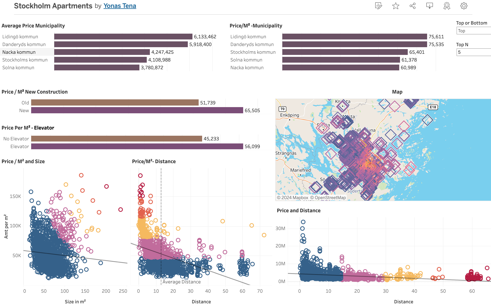

# Stockholm-Housing-Market
### Housing Prices Prediction Web App
This application is a Streamlit web app that can be used to predict apartment prices in Stockholm, Sweden.

The dataset for this project is created by scraping Sweden housing listing site [Booli](https://www.booli.se/) and [Hemnet](https://www.hemnet.se/).

The web app for the project is found [here](https://stockholmhousingmarket.streamlit.app/)

